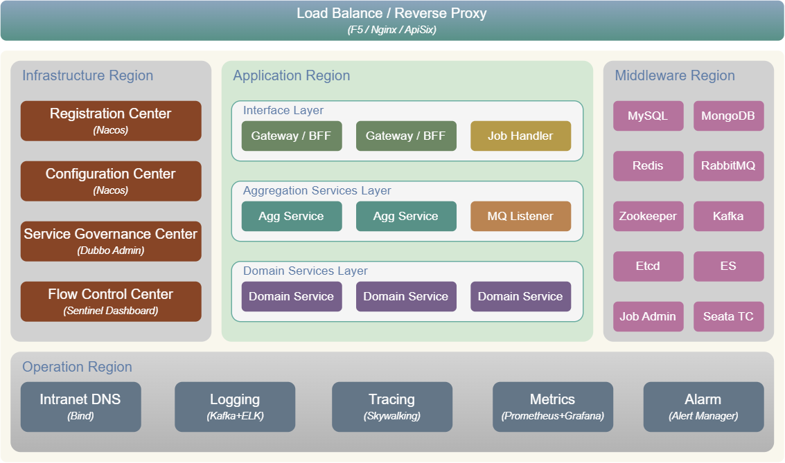

---

#  HP-SOA
功能完备，简单易用，高度可扩展的Java微服务框架。

【[快速开始](misc/doc/user_guide.md)】

### 技术架构


### 技术集成
- Web服务框架：spring-boot 3.x
- 微服务框架：spring-cloud 4.x
- 微服务框架：Dubbo 3.x
- 服务注册中心：Nacos
- 配置中心：Nacos
- 服务治理中心：Dubbo Admin
- 流量控制中心：Sentinel Dashboard + Nacos
- 数据库：MySQL、mybatis-plus（支持多数据源）
- 缓存：Redis + Redisson（支持多实例）
- NoSQL数据库：MongoDB
- 搜索引擎：Elasticsearch
- 消息总线：RabbitMQ（支持多实例、可靠消息、Stream 消息）
- 消息队列：Kafka（支持可靠消息）
- MQTT发布订阅：Eclipse PAHO mqttv5
- 分布式Job：xxl-job
- 轻量级Job：Redisson + Spring Scheduled
- 分布式事务：Seata
- 全局ID：Leaf（支持 Snowflake ID 和 Segment ID）
- 统一日志：Log4j + Kafka + ELK
- 调用链跟踪：Skywalking
- 监控告警：Prometheus + Grafana + Alert Manager

### 模块说明
- **[hp-soa-dependencies](hp-soa-dependencies)** 依赖管理模块，定义依赖包及其版本
- **[hp-soa-framework-core](hp-soa-framework/hp-soa-framework-core)** 基础模块，定义 HP-SOA 基础组件和工具
- **[hp-soa-framework-web](hp-soa-framework/hp-soa-framework-web)** Web应用模块，集成 spring-boot，提供核心Web服务功能
- **[hp-soa-framework-leaf](hp-soa-framework/hp-soa-framework-leaf)** Leaf全局ID模块，基于Leaf，提供分布式全局ID功能
- **[hp-soa-framework-gelf](hp-soa-framework/hp-soa-framework-gelf)** GELF日志模块，提供TCP、UDP、HTTP、Redis、Kafka等远程日志传输功能
- **[hp-soa-framework-util](hp-soa-framework/hp-soa-framework-util)** 工具包模块，提供文件处理、邮件、远程访问等组件和工具
- **[hp-soa-starter-web](hp-soa-starter/hp-soa-starter-web)** Web应用启动器，配置并启动应用服务，所有 HP-SOA 项目都必须引入该启动器
- **[hp-soa-starter-web-cloud](hp-soa-starter/hp-soa-starter-web-cloud)** Spring Cloud 启动器，开启 Spring Cloud 微服务功能，所有 Spring Cloud 微服务项目都必须引入该启动器
- **[hp-soa-starter-web-dubbo](hp-soa-starter/hp-soa-starter-web-dubbo)** Dubbo启动器，开启Dubbo微服务功能，所有 Dubbo 微服务项目都必须引入该启动器
- **[hp-soa-starter-task](hp-soa-starter/hp-soa-starter-task)** Task启动器，开启 Spring Task 功能，并为 Spring Task 提供日志关联和调用链跟踪能力
- **[hp-soa-starter-nacos](hp-soa-starter/hp-soa-starter-nacos)** Nacos配置中心启动器，开启配置中心功能，应用程序可以从远程配置中心加载配置
- **[hp-soa-starter-data-mysql](hp-soa-starter/hp-soa-starter-data-mysql)** MySQL启动器，开启MySQL数据库访问功能，并提供动态数据源、数据源监控和全局事务管理等能力
- **[hp-soa-starter-data-redis](hp-soa-starter/hp-soa-starter-data-redis)** Redis启动器，开启Redis访问功能，支持多Redis实例，支持Spring Cache
- **[hp-soa-starter-data-mongodb](hp-soa-starter/hp-soa-starter-data-mongodb)** MongoDB启动器，开启MongoDB访问功能，支持通过 Spring Data 接口方式访问MongoDB
- **[hp-soa-starter-data-elasticsearch](hp-soa-starter/hp-soa-starter-data-elasticsearch)** Elasticsearch启动器，开启Elasticsearch访问功能，支持通过 Spring Data 接口方式访问Elasticsearch
- **[hp-soa-starter-rabbitmq](hp-soa-starter/hp-soa-starter-rabbitmq)** Rabbitmq启动器，开启Rabbitmq访问功能，支持多Rabbitmq实例，提供可靠消息实施方案以及消息跟踪能力
- **[hp-soa-starter-kafka](hp-soa-starter/hp-soa-starter-kafka)** Kafka启动器，开启Kafka访问功能，提供可靠消息实施方案以及消息跟踪能力
- **[hp-soa-starter-mqtt](hp-soa-starter/hp-soa-starter-mqtt)** MQTT启动器，开启MQTT发布订阅功能，全面支持mqttv5协议
- **[hp-soa-starter-job-exclusive](hp-soa-starter/hp-soa-starter-job-exclusive)** 轻量级Job启动器，开启轻量级排他Job功能，提供Job执行日志关联和调用链跟踪能力
- **[hp-soa-starter-job-xxljob](hp-soa-starter/hp-soa-starter-job-xxljob)** Xxl-Job启动器，开启 Xxl-Job 功能，结合 xxl-job-admin 提供分布式Job能力
- **[hp-soa-starter-leaf](hp-soa-starter/hp-soa-starter-leaf)** Leaf全局ID启动器，开启Leaf全局ID功能，支持通过Snowflake算法和Segment算法生成全局ID
- **[hp-soa-starter-seata](hp-soa-starter/hp-soa-starter-seata)** Seata启动器，开启Seata分布式事务功能，结合 Seata TC 提供分布式事务能力
- **[hp-soa-starter-sentinel](hp-soa-starter/hp-soa-starter-sentinel)** Sentinel启动器，开启Sentinel流量控制功能，结合 Sentinel Dashboard 和 Nacos 提供流量控制和流控规则持久化能力
- **[hp-soa-starter-skywalking](hp-soa-starter/hp-soa-starter-skywalking)** Skywalking启动器，开启Skywalking调用链跟踪功能，结合 Skywalking Agent 和 Skywalking Server 提供调用链跟踪能力

### 应用接入（参考：[hp-demo](hp-demo/)）
1. pom.xml 中添加 HP-SOA 依赖
```xml
<dependencyManagement>
    <dependencies>
        <!-- 添加 hp-soa 依赖管理 -->
        <dependency>
            <groupId>io.github.hpsocket</groupId>
            <artifactId>hp-soa-dependencies</artifactId>
            <version>${hp-soa.version}</version>
            <type>pom</type>
            <scope>import</scope>
        </dependency>
    </dependencies>
</dependencyManagement>

<dependencies>
    <!-- 普通项目引用 hp-soa-starter-web -->
    <dependency>
        <groupId>io.github.hpsocket</groupId>
        <artifactId>hp-soa-starter-web</artifactId>
    </dependency>
    <!-- Spring Cloud 项目引用 hp-soa-starter-web-cloud -->
    <!--
    <dependency>
        <groupId>io.github.hpsocket</groupId>
        <artifactId>hp-soa-starter-web-cloud</artifactId>
    </dependency>
    -->
    <!-- Dubbo项目引用 hp-soa-starter-web-dubbo -->
    <!--
    <dependency>
        <groupId>io.github.hpsocket</groupId>
        <artifactId>hp-soa-starter-web-dubbo</artifactId>
    </dependency>
    -->
    <!-- 根据项目需要，引用其它 hp-soa starter -->
    <dependency>
        <groupId>io.github.hpsocket</groupId>
        <artifactId>hp-soa-starter-xxx</artifactId>
    </dependency>
</dependencies>
```
2. 修改应用配置（参考 Demo [hp-demo-bff-basic](hp-demo/hp-demo-bff-basic) 的[本地配置文件](hp-demo/hp-demo-bff-basic/src/main/resources/bootstrap.yml) ，配置中心的[远程配置文件](misc/nacos/config/namespace-DEV/GLOBAL_GROUP)），主要配置项：
    - hp.soa.web
    - spring.cloud (Spring Cloud 项目)
    - dubbo (Dubbo项目)
    - server
    - spring
    - management
    - springdoc
3. 修改全局配置（可选）
    - 系统配置文件，用于设置系统属性，默认配置文件：`/opt/hp-soa/config/system-config.properties`参考：[system-config.properties](misc/opt/hp-soa/config/system-config.properties)
    - 扩展配置文件，用于配置注册中心地址、配置中心地址等公共属性，默认配置文件：`/opt/hp-soa/config/extended-config.properties`参考：[extended-config.properties](misc/opt/hp-soa/config/extended-config.properties)
4. 实现 HTTP 鉴权接口（可选）
    - 如果是Gateway/BFF应用，并且应用属性`hp.soa.web.access-verification.enabled = true`，则需要实现[AccessVerificationService](hp-soa-framework/hp-soa-framework-web/src/main/java/io/github/hpsocket/soa/framework/web/service/AccessVerificationService.java)接口，用于HTTP请求鉴权。
5. 启动应用
    - 以[io.github.hpsocket.soa.framework.web.server.main.AppStarter](hp-soa-framework/hp-soa-framework-web/src/main/java/io/github/hpsocket/soa/framework/web/server/main/AppStarter.java)作为启动类，启动应用程序。
    - JVM启动参数参考：[JVM启动参数示例](misc/jvm/java-opts.txt)

---

[[用户指南](misc/doc/user_guide.md)]