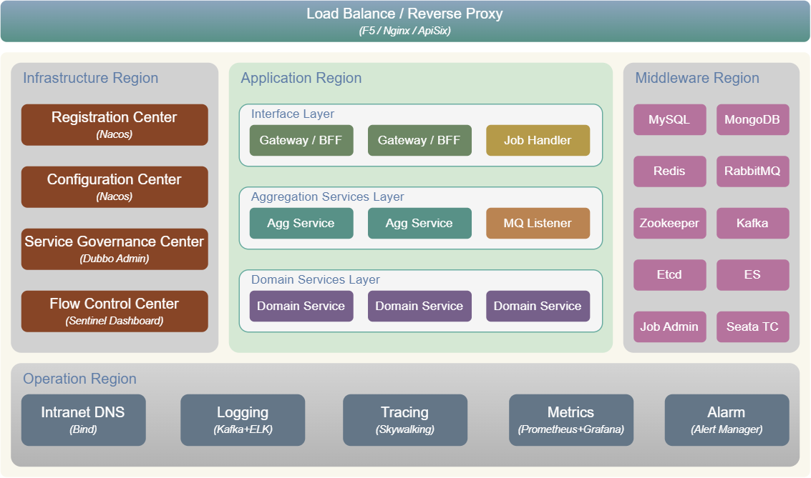

#  HP-SOA
功能完备，简单易用，高度可扩展的Java微服务框架。

### 技术架构


### 技术集成
- Web服务框架：spring-boot 3.x
- 微服务框架：Dubbo 3.x
- 服务注册中心：Nacos
- 配置中心：Nacos
- 服务治理中心：Dubbo Admin
- 流量控制中心：Sentinel Dashboard + Nacos
- 数据库：MySQL、Druid、mybatis-plus（支持多数据源）
- 缓存：Redis + Redisson（支持多实例）
- 消息总线：RabbitMQ（支持多实例，支持可靠消息）
- 分布式Job：xxl-job
- 轻量级Job：Redisson + Spring Scheduled
- 分布式事务：Seata
- 全局ID：Leaf（支持 Snowflake ID 和 Segment ID）
- 统一日志：Log4j + Kafka + ELK
- 调用链跟踪：Skywalking
- 监控告警：Prometheus + Grafana + Alert Manager

### 应用接入（参考：[hp-demo](hp-demo/)）
1. pom.xml 中添加 HP-SOA 依赖
```xml
<dependencyManagement>
    <dependencies>
        <!-- 添加 hp-soa 依赖管理 -->
        <dependency>
            <groupId>io.github.hpsocket</groupId>
            <artifactId>hp-soa-dependencies</artifactId>
            <version>${hp-soa.version}</version>
            <type>pom</type>
            <scope>import</scope>
        </dependency>
    </dependencies>
</dependencyManagement>

<dependencies>
    <!-- 引用 hp-soa-starter-web -->
    <dependency>
        <groupId>io.github.hpsocket</groupId>
        <artifactId>hp-soa-starter-web</artifactId>
    </dependency>
    <!-- 引用 hp-soa 其它 starter -->
    <dependency>
        <groupId>io.github.hpsocket</groupId>
        <artifactId>hp-soa-starter-xxx</artifactId>
    </dependency>
</dependencies>
```
2. 修改应用配置（参考 Demo [hp-demo-bff-basic](hp-demo/hp-demo-bff-basic/src/main/resources/bootstrap.yml)，[hp-demo-bff-nacos](hp-demo/hp-demo-bff-nacos/src/main/resources/bootstrap.yml)）
    - hp.soa.web
    - dubbo
    - server
    - spring
    - management
    - springdoc
3. 修改全局配置（可选）
    - 系统配置文件，用于设置系统属性，默认配置文件：`/opt/hp-soa/config/system-config.properties`参考：[system-config.properties](misc/opt/hp-soa/config/system-config.properties)
    - 扩展配置文件，用于配置注册中心地址、配置中心地址等公共属性，默认配置文件：`/opt/hp-soa/config/extended-config.properties`参考：[extended-config.properties](misc/opt/hp-soa/config/extended-config.properties)
4. 实现HTTP鉴权接口（可选）
    - 如果是Gateway/BFF应用，并且应用属性`hp.soa.web.access-verification.enabled = true`，则需要实现[AccessVerificationService](hp-soa-framework/hp-soa-framework-web/src/main/java/io/github/hpsocket/soa/framework/web/service/AccessVerificationService.java)接口，用于HTTP请求鉴权。
5. 启动应用
    - 以[io.github.hpsocket.soa.framework.web.server.main.AppStarter](hp-soa-framework/hp-soa-framework-web/src/main/java/io/github/hpsocket/soa/framework/web/server/main/AppStarter.java)作为启动类，启动应用程序。
    - JVM启动参数参考：[java-opts.txt](misc/jvm/java-opts.txt)