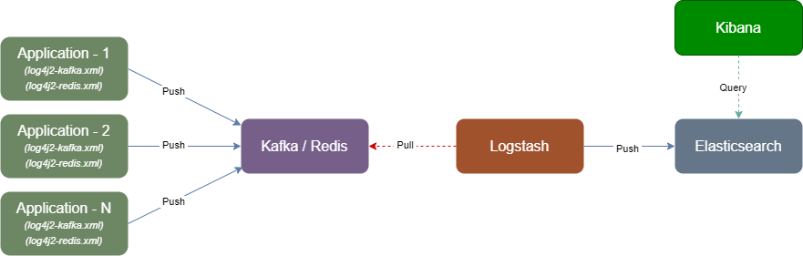

[[用户指南](user_guide.md)]

---

## 一、概述

&nbsp;&nbsp;HP-SOA 通过Log4j把应用程序日志发送到Kafka或Redis等中间件，然后转发到ELK日志系统。



1. 日志基本字段：

    - ***log_type*** - 自定义日志类型，用于ELK对日志进行合并归类
    - ***log_time*** - 日志记录时间
    - ***facility*** - 日志类别（如：常规服务日志，监控日志）
    - ***level*** - 日志等级
    - ***source_host*** - 日志来源主机名称
    - ***source_ip*** - 日志来源主机IP地址
    - ***thread_name*** - 线程名称
    - ***logger_name*** - Logger名称
    - ***file*** - 文件
    - ***class*** - 类
    - ***method*** - 方法
    - ***line_number*** - 行号
    - ***message*** - 日志内容
    - ***@timestamp*** - ELK系统接收日志时间
    - ***@version*** - 应用程序版本

2. `SOA-MONITOR`日志记录客户端对服务系统调用的入口和出口信息，增加以下日志字段：

    - ***monitor_type*** - 监控日志类型，如：*MONITOR-INGRESS*（入口监控日志，客户端调用服务系统）、*MONITOR-EGRESS*（出口监控日志，服务系统调用外部系统）
    - ***requestUri*** - 请求完整地址
    - ***requestPath*** - 请求路径
    - ***requestMethod*** - 请求方法（POST、GET、...）
    - ***clientAddr*** - 调用方IP地址
    - ***request*** - 请求内容
    - ***statusCode*** - 响应状态码
    - ***resultCode*** - 响应结果码
    - ***costTime*** - 响应耗时
    - ***msg*** - 响应描述
    - ***response*** - 响应内容
    - ***geoip.**** - 客户端地理位置信息
    - ***ua.**** - 客户端浏览器信息

3. 日志跟踪字段：

    - ***mdc.__traceId*** - AMP组件（如：Skywalking）的traceId
    - ***mdc.__requestId*** - 调用链请求ID
    - ***mdc.__clientId*** - 调用链客户端ID（客户端ID标识一个客户，跨多个调用链）
    - ***mdc.__sessionId*** - 调用链会话ID（会话ID跨多个调用链，由调用方传入）
    - ***mdc.__messageId*** - 消息ID（消息队列消费者当前正在处理的消息ID）
    - ***mdc.__sourceRequestId*** - 源调用链请求ID（消息队列消费者当前正在处理的消息的生产者源调用链请求ID）
    - ***mdc.__appCode*** - 调用目标 App Code
    - ***mdc.__srcAppCode*** - 调用方 App Code
    - ***mdc.__token*** - 用户Token
    - ***mdc.__userId*** - 用户ID
    - ***mdc.__groupId*** - 组织ID
    - ***mdc.__appId*** - 入口应用程序ID
    - ***mdc.__appName*** - 入口应用程序名称
    - ***mdc.__version*** - 版本属性（由调用方传入）
    - ***mdc.__extra*** - 附加属性（由调用方传入）
    - ***mdc.__serviceId*** - 当前服务ID
    - ***mdc.__serviceName*** - 当前服务名称
    - ***mdc.__serviceAddr*** - 当前服务实例IP地址
    - ***mdc.__fromServiceId*** - 上游服务ID
    - ***mdc.__fromServiceName*** - 上游服务名称
    - ***mdc.__fromServiceAddr*** - 上游服务实例IP地址

&nbsp;&nbsp;通过上述日志字段可以快速定位调用链，排查问题；也可以对日志进行分析处理，统计系统性能、质量、错误率等指标；同时，还可以接入Dashboard大盘和监控告警系统，实时展示和发现系统异常。

## 二、ELK日志系统部署

#### 1. ELK日志系统安装
（略）

#### 2. ELK日志系统配置

1. Logstash配置

&nbsp;&nbsp;Logstash从Kafka/Redis获取输入日志，经过处理后推送到Elasticsearch。（参考[logstash.conf](../elk/logstash-conf/logstash.conf)）

```ruby
## Kafka Input
input {
  kafka {
    bootstrap_servers => ["kafka:9092"]
    topics => ["hp-soa"]
    # 所有 logstash 实例配置相同 group
    group_id => "elk"
    # 自动将偏移量重置为最新偏移量
    auto_offset_reset => "latest"
    # 自定义一个类型名称
    #type => "hp-soa"
    # 规则：分区数 = N * (Logstash节点数 * Logstash.consumer_threads)，N 最好等于 1
    consumer_threads => 1
    # 解码方式
    codec => json
  }
}

## Redis Input
input {
    redis {
        key => "hp-soa"
        host => "192.168.56.23"
        port => 6379
        db => "0"
        #password => "123456"
        data_type => "list"
    }
}

filter {
  mutate {
    remove_field => ['[event]']    
  }
  
  if [log_type] == 'hp-soa' {
    if [facility] == 'SOA-MONITOR' {
        json {
            source => "message"
            #target => "doc"
            remove_field => ["message"]
        }
        geoip {
            source => "clientAddr"
            target => "geoip"
            fields => ["location", "region_name", "region_iso_code", "country_name", "country_code2", "continent_name", "city_name"] 
        }
    }    
  }
}

# 调试时打开
output {  
  stdout { }
}

output {
if [log_type] == 'hp-soa' {
    elasticsearch {
       hosts => ["elasticsearch:9200"]
       index => "hp-soa-%{+YYYY.MM.dd}"
     }
  }
}
```

2. Elasticsearch配置  

&nbsp;&nbsp;*注：如果不需解析客户端地理位置信息，不必创建“地理位置信息处理Pipeline”，同时在“日志索引模版”中移除对该Pipeline的引用。*

- 创建地理位置信息处理Pipeline（参考[hp-soa-geoip-pipeline.json.put](../elk/es-template/1-hp-soa-geoip-pipeline.json.put)）

```json
PUT _ingest/pipeline/hp-soa-geoip-pipeline
{
  "description" : "process hp-soa geoip info",
  "processors" : [
    {
      "geoip" : {
        "field" : "clientAddr",
        "ignore_failure": true
      }
    }
  ]
}
```

- 创建日志生命周期策略（参考[hp-soa-lifecycle-policy.json.put](../elk/es-template/2-hp-soa-lifecycle-policy.json.put)）

```json
PUT _ilm/policy/hp-soa-lifecycle-policy
{
  "policy": {
    "phases": {
      "hot": {
        "min_age": "0ms",
        "actions": {
          "set_priority": {
            "priority": 100
          }
        }
      },
      "warm": {
        "min_age": "3d",
        "actions": {
          "set_priority": {
            "priority": 50
          }
        }
      },
      "delete": {
        "min_age": "15d",
        "actions": {
          "delete": {
            "delete_searchable_snapshot": true
          }
        }
      }
    }
  }
}
```

- 创建日志索引模版（参考[hp-soa-template.json.put](../elk/es-template/3-hp-soa-template.json.put)）

```json
PUT _index_template/hp-soa-template
{
    "priority": 100,
    "version": 1,
    "index_patterns": [
        "hp-soa-*"
    ],
    "template": {
        "aliases": {
            "hp-soa": {
                
            }
        },
        "settings": {
            "number_of_shards": 3,
            "number_of_replicas": 0,
            "index.lifecycle.name": "hp-soa-lifecycle-policy",
            "index.default_pipeline": "hp-soa-geoip-pipeline"
        },
        "mappings": {
            "_source": {
                "enabled": true
            },
            "dynamic_templates": [
                {
                    "time_template": {
                        "match_mapping_type": "string",
                        "match_pattern": "regex",
                        "match": "^[0-9-a-z_]*(time|Time)$",
                        "mapping": {
                            "type": "date",
                            "format": "yyyy-MM-dd HH:mm:ss || yyyy-MM-dd HH:mm:ss.SSS || yyyy-MM-dd'T'HH:mm:ss.SSS'Z' || yyyy-MM-dd'T'HH:mm:ss'Z' || yyyy-MM-dd || epoch_millis"
                        }
                    }
                },
                {
                    "long_id_template": {
                        "match_mapping_type": "long",
                        "match_pattern": "regex",
                        "match": "^[0-9-a-z_]*(id|Id)$",
                        "mapping": {
                            "type": "long"
                        }
                    }
                },
                {
                    "str_id_template": {
                        "match_mapping_type": "string",
                        "match_pattern": "regex",
                        "match": "^[0-9-a-z_]*(id|Id)$",
                        "mapping": {
                            "type": "keyword"
                        }
                    }
                },
                {
                    "long_template": {
                        "match_mapping_type": "long",
                        "match": "*",
                        "mapping": {
                            "type": "long"
                        }
                    }
                },
                {
                    "double_template": {
                        "match_mapping_type": "double",
                        "match": "*",
                        "mapping": {
                            "type": "double"
                        }
                    }
                },
                {
                    "text_template": {
                        "match_mapping_type": "string",
                        "match": "*",
                        "mapping": {
                            "type": "text"
                        }
                    }
                }
            ],
            "properties": {
                "geoip": {
                    "properties": {
                        "location": {
                            "type": "geo_point"
                        },
                        "region_name": {
                            "type": "keyword"
                        },
                        "region_iso_code": {
                            "type": "keyword"
                        },
                        "country_name": {
                            "type": "keyword"
                        },
                        "country_iso_code": {
                            "type": "keyword"
                        },
                        "continent_name": {
                            "type": "keyword"
                        },
                        "city_name": {
                            "type": "keyword"
                        }
                    }
                },
                "@timestamp": {
                    "type": "date"
                },
                "@version": {
                    "type": "keyword"
                },
                "apiName": {
                    "type": "keyword"
                },
                "appCode": {
                    "type": "keyword"
                },
                "appId": {
                    "type": "keyword"
                },
                "appName": {
                    "type": "keyword"
                },
                "class": {
                    "type": "text"
                },
                "clientAddr": {
                    "type": "keyword"
                },
                "clientId": {
                    "type": "keyword"
                },
                "costTime": {
                    "type": "long"
                },
                "exception": {
                    "properties": {
                        "exception_class": {
                            "type": "text"
                        },
                        "exception_message": {
                            "type": "text"
                        },
                        "stacktrace": {
                            "type": "text"
                        }
                    }
                },
                "facility": {
                    "type": "keyword"
                },
                "file": {
                    "type": "text"
                },
                "groupId": {
                    "type": "long"
                },
                "level": {
                    "type": "keyword"
                },
                "line_number": {
                    "type": "long"
                },
                "log_time": {
                    "type": "date"
                },
                "log_type": {
                    "type": "keyword"
                },
                "logger_name": {
                    "type": "text"
                },
                "mdc": {
                    "properties": {
                        "__appCode": {
                            "type": "keyword"
                        },
                        "__appId": {
                            "type": "keyword"
                        },
                        "__appName": {
                            "type": "keyword"
                        },
                        "__clientId": {
                            "type": "keyword"
                        },
                        "__fromServiceAddr": {
                            "type": "keyword"
                        },
                        "__fromServiceId": {
                            "type": "keyword"
                        },
                        "__fromServiceName": {
                            "type": "keyword"
                        },
                        "__organization": {
                            "type": "keyword"
                        },
                        "__owner": {
                            "type": "keyword"
                        },
                        "__requestId": {
                            "type": "keyword"
                        },
                        "__messageId": {
                            "type": "keyword"
                        },
                        "__sourceRequestId": {
                            "type": "keyword"
                        },
                        "__version": {
                            "type": "keyword"
                        },
                        "__extra": {
                            "type": "keyword"
                        },
                        "__traceId": {
                            "type": "keyword"
                        },
                        "__spanId": {
                            "type": "keyword"
                        },
                        "__serviceAddr": {
                            "type": "keyword"
                        },
                        "__serviceId": {
                            "type": "keyword"
                        },
                        "__serviceName": {
                            "type": "keyword"
                        },
                        "__token": {
                            "type": "keyword"
                        },
                        "__isEntry": {
                            "type": "keyword"
                        },
                        "__groupId": {
                            "type": "keyword"
                        },
                        "__userId": {
                            "type": "keyword"
                        }
                    }
                },
                "message": {
                    "type": "text"
                },
                "method": {
                    "type": "text"
                },
                "monitor_type": {
                    "type": "keyword"
                },
                "msg": {
                    "type": "text"
                },
                "organization": {
                    "type": "keyword"
                },
                "owner": {
                    "type": "keyword"
                },
                "request": {
                    "type": "text"
                },
                "requestId": {
                    "type": "keyword"
                },
                "requestMethod": {
                    "type": "keyword"
                },
                "requestPath": {
                    "type": "text"
                },
                "requestUri": {
                    "type": "text"
                },
                "response": {
                    "type": "text"
                },
                "resultCode": {
                    "type": "long"
                },
                "serviceAddr": {
                    "type": "keyword"
                },
                "serviceId": {
                    "type": "keyword"
                },
                "serviceName": {
                    "type": "keyword"
                },
                "source_host": {
                    "type": "keyword"
                },
                "source_ip": {
                    "type": "keyword"
                },
                "statusCode": {
                    "type": "long"
                },
                "thread_name": {
                    "type": "text"
                },
                "timestamp": {
                    "type": "long"
                },
                "token": {
                    "type": "keyword"
                },
                "ua": {
                    "properties": {
                        "browser": {
                            "type": "keyword"
                        },
                        "browserType": {
                            "type": "keyword"
                        },
                        "deviceType": {
                            "type": "keyword"
                        },
                        "name": {
                            "type": "text"
                        },
                        "platform": {
                            "type": "keyword"
                        }
                    }
                },
                "userId": {
                    "type": "long"
                }
            }
        }
    }
}
```

## 三、应用接入

&nbsp;&nbsp;应用程序接入ELK日志系统非常简单，只需在Log4j配置文件中定义相应Appender，Appender把日志写入本地文件或把日志推送到Kafka/Redis。参考以下Log4j配置文件模版：

1. ***[log4j2-kafka.xml](../conf/log4j2-kafka.xml)*** 通过 [Kafka Appender](https://logging.apache.org/log4j/2.x/manual/appenders.html#KafkaAppender) 把日志推送到Kafka。
2. ***[log4j2-redis.xml](../conf/log4j2-redis.xml)*** 通过 [Redis Appender](https://github.com/vy/log4j2-redis-appender) 把日志推送到Redis。
3. ***[log4j2-gelf.xml](../conf/log4j2-gelf.xml)*** 通过 [Gelf Appender](../../hp-soa-framework/hp-soa-framework-gelf) 把日志推送到Kafka或Redis。
4. ***[log4j2-json.xml](../conf/log4j2-json.xml)*** 日志以JSON格式写到本地文件，可以通过Filebeat等日志收集器把本地文件日志推送到Kafka、Redis或Logstash。

---

[[用户指南](user_guide.md)]