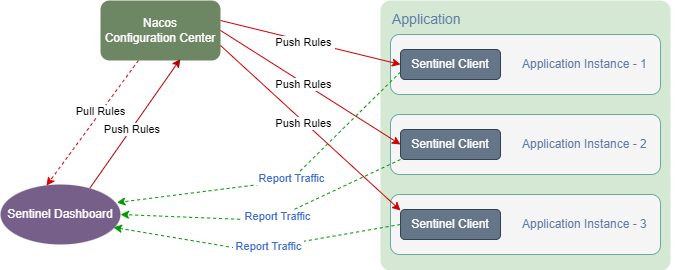

[[用户指南](user_guide.md)]

---

## 一、概述
&nbsp;&nbsp;HP-SOA 的 [hp-soa-starter-sentinel](../../hp-soa-starter/hp-soa-starter-sentinel) 模块提供了[sentinel](https://github.com/alibaba/Sentinel)流量治理功能，同时提供了基于Nacos数据源的 [Sentinel Dashboard](../../misc/sentinel)，可实现流控规则持久化和PUSH模式规则推送（规则推送模式参考：[Sentinel规则管理及推送](https://github.com/alibaba/Sentinel/wiki/%E5%9C%A8%E7%94%9F%E4%BA%A7%E7%8E%AF%E5%A2%83%E4%B8%AD%E4%BD%BF%E7%94%A8-Sentinel)）。



## 二、安装启动 Sentinel Dashboard

1. 把 [misc/sentinel](../../misc/sentinel) 目录下的文件拷贝到目标目录。
2. 修改`start-sendinel-dashboard.sh (.bat)`启动脚本，调整 Sentinel Dashboard 配置（详细配置参考：[Sentinel控制台文档](https://sentinelguard.io/zh-cn/docs/dashboard.html)）。
3. 执行`start-sendinel-dashboard.sh (.bat)`启动脚本，启动 Sentinel Dashboard 应用程序。

- [start-sendinel-dashboard.sh](../../misc/sentinel/start-sendinel-dashboard.sh) 启动脚本示例：

```shell
#!/bin/bash

java \
-Xms128m \
-Xmx256m \
-Dserver.port=8080 \
-Dcsp.sentinel.dashboard.server=0.0.0.0:8080 \
-Dproject.name=sentinel-dashboard \
-Dauth.enabled=true \
-Dsentinel.dashboard.auth.username=sentinel \
-Dsentinel.dashboard.auth.password=123456 \
-Dserver.servlet.session.timeout=86400 \
-Dsentinel.nacos.serverAddr=192.168.56.23:8848 \
-Dsentinel.nacos.username=nacos \
-Dsentinel.nacos.password=123456 \
-Dsentinel.nacos.namespace=DEV \
-jar sentinel-dashboard.jar
```

## 三、接入步骤

#### 1. 引入 [hp-soa-starter-sendinel](../../hp-soa-starter/hp-soa-starter-sendinel) 依赖
- pom.xml 中添加 [hp-soa-starter-nacos](../../hp-soa-starter/hp-soa-starter-nacos) 和 [hp-soa-starter-sendinel](../../hp-soa-starter/hp-soa-starter-sendinel) 依赖：
```xml
<!-- 引用 hp-soa-starter-nacos-->
<dependency>
    <groupId>io.github.hpsocket</groupId>
    <artifactId>hp-soa-starter-nacos</artifactId>
</dependency>
<!-- 引用 hp-soa-starter-sentinel-->
<dependency>
    <groupId>io.github.hpsocket</groupId>
    <artifactId>hp-soa-starter-sentinel</artifactId>
</dependency>
```

#### 2. 修改Sentinel配置

&nbsp;&nbsp;配置示例参考[sentinel.yml](../../misc/nacos/config/namespace-DEV/GLOBAL_GROUP/sentinel.yml)。

---

[[用户指南](user_guide.md)]