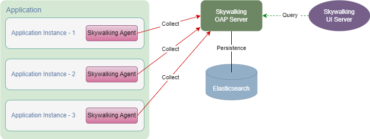

[[用户指南](user_guide.md)]

---

## 一、概述
&nbsp;&nbsp;HP-SOA 的 [hp-soa-starter-skywalking](../../hp-soa-starter/hp-soa-starter-skywalking) 模块提供了[Skywalking](https://github.com/apache/skywalking)调用链跟踪功能，支持包括HTTP服务、Dubbo服务、Job应用和消息队列应用在内的全链路调用链跟踪。

&nbsp;&nbsp;Skywalking Agent 采集应用程序实例的调用链片段数据并上报到 Skywalking OAP Server，Skywalking OAP Server 生成完整调用链并保存到持久化存储，Skywalking UI 给用户提供调用链查询、分析的可视化界面。



## 二、安装 Skywalking OAP Server / Skywalking UI

参考：[SkyWalking Quick Start](https://skywalking.apache.org/zh/2020-04-19-skywalking-quick-start/)

## 三、接入步骤

#### 1. 引入 [hp-soa-starter-skywalking](../../hp-soa-starter/hp-soa-starter-skywalking) 依赖
- pom.xml 中添加 [hp-soa-starter-skywalking](../../hp-soa-starter/hp-soa-starter-skywalking) 依赖：

```xml
<!-- 引用 hp-soa-starter-skywalking-->
<dependency>
    <groupId>io.github.hpsocket</groupId>
    <artifactId>hp-soa-starter-skywalking</artifactId>
</dependency>
```

#### 2. 接入 Skywalking Agent

&nbsp;&nbsp;应用程序启动时，通过 `-javaagent` JVM 参数接入 Skywalking Agent：

```shell
java\
-javaagent:/opt/skywalking-agent/skywalking-agent.jar=\
agent.service_name=hp-demo-mqtt,\
collector.backend_service=192.168.56.23:11800,\
logging.level=WARN,logging.dir=/data/logs/skywalking,\
logging.file_name=skywalking-agent_hp-demo-mqtt.log,\
logging.max_file_size=10485760,\
logging.max_history_files=10\
-jar hp-demo-mqtt.jar
```

&nbsp;&nbsp;上例中，`collector.backend_service` 参数设置 Skywalking OAP Server 地址，`agent.service_name` 参数设置应用程序名称，`logging.*` 参数设置日志相关信息。详细配置参考 Skywalking Agent 安装目录下的 [config/agent.config](https://github.com/apache/skywalking-java/blob/main/apm-sniffer/config/agent.config)。

## 四、Docker 接入支持

&nbsp;&nbsp;Docker 容器的应用程序要支持 Skywalking APM 监控需要执行以下操作：

1. **Skywalking Java Agent 部署到镜像：** 把 Skywalking Java Agent 相关文件复制到 Docker 构建上下文的 *skywalking-agent* 目录，[docker-build.sh](../../misc/docker/docker-build.sh) 镜像构建脚本会把该目录复制到镜像的 */opt/skywalking-agent* 目录。
2. **应用程序注入 Skywalking javaagent：** 把 Skywalking javaagent 配置写入 Docker 构建上下文的 [opt/hp-soa/config/$RUNTIME_ENV/java-agent.config](../../misc/docker/opt/hp-soa/config/java-agent.config)，该文件会在镜像构建时复制到目标镜像，并在容器启动时由 [start-foreground.sh](../../misc/docker/bin/start-foreground.sh) 容器运行脚本处理并加载相应 javaagent。

（详细内容请参考：[应用打包部署](../../misc/doc/deploy.md)）

---

[[用户指南](user_guide.md)]